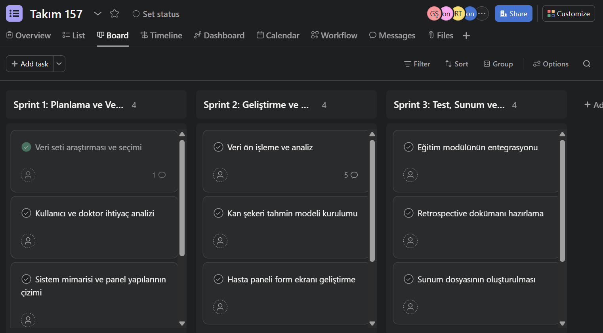
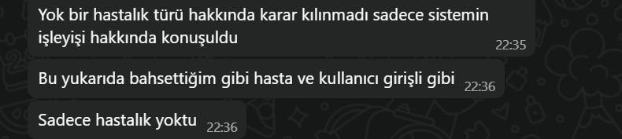
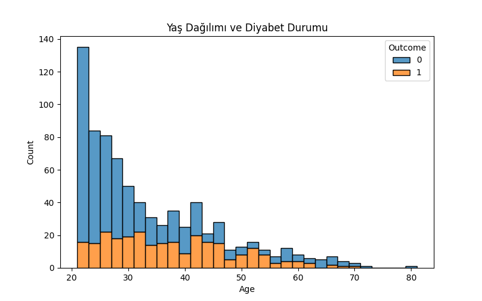
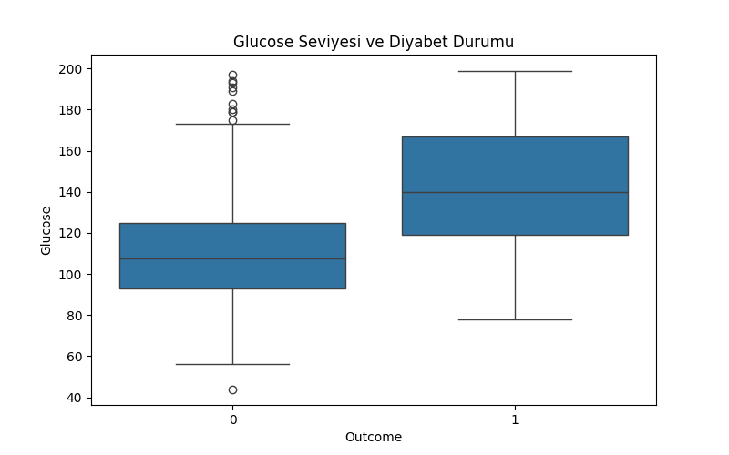
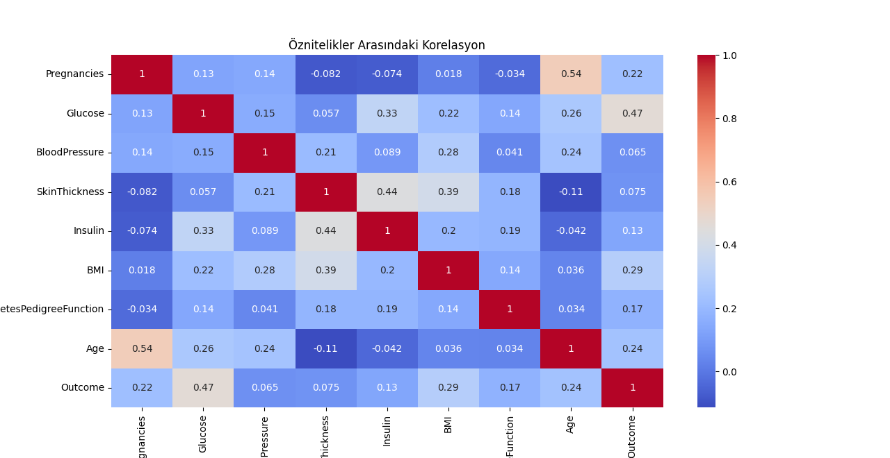

# YZTA-Grup-157
DiabetCare AI – Diyabet Yönetim Asistanı Projesi

DiabetCare AI, diyabet hastalarının günlük kan şekeri takibi, beslenme ve fiziksel aktivite kayıtlarını kolayca yönetebilecekleri, aynı zamanda doktorların hastalarını uzaktan takip edip analiz edebilecekleri yapay zeka destekli bir dijital sağlık asistanıdır. Proje, kullanıcıların kan şekeri dalgalanmalarını tahmin eden modeller ve kişiselleştirilmiş beslenme önerileri gibi özelliklerle hastaların yaşam kalitesini artırmayı hedefler. Hasta ve doktor panelleri aracılığıyla veri girişinden raporlamaya kadar kapsamlı bir takip sistemi sunarken, eğitim modülü ile kullanıcıların diyabet hakkında bilinçlenmelerini destekler. Türkiye’de milyonlarca diyabet hastasının ihtiyaçlarına cevap verecek şekilde tasarlanmış bu proje, veri zenginliği ve sürdürülebilir takip avantajları ile sağlık alanında yapay zekanın etkin kullanımını göstermektedir.

## Sprint 1: Planlama ve Veri Hazırlığı

Sprint içinde tamamlanması tahmin edilen puan: 100 Puan

**Puan tamamlama mantığı:**

Projenin toplamında 340 puanlık backlog tanımlanmıştır. Bu iş yükü 3 sprint'e eşit şekilde bölünmüş ve ilk sprint’in en azından 100 puanlık görevle başlaması gerektiğine karar verilmiştir. Bu sprintte, sonraki geliştirme sprintlerine temel oluşturacak planlama ve veri hazırlık süreçleri yer almaktadır.

**Sprint Board**

**Daily Scrum:**
Daily Scrum toplantılarının zamansal nedenlerle Whatsapp grubu üzerinden yapılmasına karar verilmiştir. 

**Sprint süresince tamamlanan görevler:**

Veri seti araştırması ve seçimi:
UCI ML Repository ve Kaggle platformlarında yer alan açık kaynaklı diyabet veri setleri araştırılmış, proje için en uygun veri seti belirlenmiştir.

Kullanıcı hikayeleri yazımı:
Sprint 1 içinde tamamlanması planlanmış fakat süre kısıtı nedeniyle Sprint 2’ye taşınmıştır.

**Ürün Durumu**

**Sprint Review:**
Sprint sonunda, proje kapsamında belirlenen temel planlama görevlerinin büyük bir kısmı başarıyla tamamlanmış ve geliştirici ekip, projenin ilk versiyonunun oluşturulmasına geçiş için gerekli altyapının hazır hale getirildiğini değerlendirmiştir. Süreç boyunca elde edilen çıktılar ve kullanıcı ihtiyaçlarına yönelik analizler doğrultusunda sprint hedeflerinin önemli bir bölümü gerçekleştirilmiş, tamamlanamayan görevler ise öncelik sırasına göre bir sonraki sprint'e aktarılmıştır. Bu aktarım sırasında, görevlerin kapsamı yeniden gözden geçirilmiş ve daha verimli bir planlama süreci için gerekli düzenlemeler yapılmıştır.

**Sprint Retrospective**

- Takım içi rol dağılımı gözden geçirilmiş, bazı görevlerde destek ihtiyacı belirlenmiştir.
- Asana görev takibi daha düzenli hale getirilmiştir.
- Bir sonraki sprintte görevlerin daha net zamanlanması gerektiğine karar verilmiştir.
- İletişim akışının artırılması için günlük geri bildirim alışkanlığı geliştirilecektir.

## Sprint 2 : Arayüz Geliştirme ve Entegrasyon
Sprint içinde tamamlanması tahmin edilen puan: 120 Puan

**Puan tamamlama mantığı:**
Projenin toplam 340 puanlık backlog’u, üç sprint’e dengeli şekilde bölünmüştür. Bu kapsamda Sprint 2’ye yaklaşık 120 puanlık görev atanmıştır. İkinci sprintte, bir önceki sprintte hazırlanan veri ve planlama temeli üzerine kullanıcı arayüzü geliştirme ve sistem bileşenlerinin entegrasyonu odak alınmıştır.

**Sprint Board**

**Daily Scrum:**
Daily Scrum toplantılarının zamansal nedenlerle Whatsapp grubu üzerinden yapılmasına karar verilmiştir. 

**Sprint süresince tamamlanan görevler:**

**Web arayüz tasarımı:**
Modelin kullanıcıya sunulması için temel web arayüzü oluşturulmuştur. Basit ve kullanıcı dostu bir yapı hedeflenmiştir.

**Sayfa yapısının genişletilmesi:**
Web sayfasına aşağıdaki modüller başarıyla entegre edilmiştir:

 - Ana Sayfa

 - Hasta Paneli

 - Doktor Paneli

**Veritabanı entegrasyonu**

Demo kullanıcı verileriyle çalışan bir veritabanı bağlantısı kurulmuştur. Temel kayıt ve giriş işlemleri test edilmiştir.

**Geliştirme ortamında sürekli test**

Demo veritabanı kayıtlarıyla sayfaların ve kullanıcı senaryolarının çalışabilirliği test edilmiş, ihtiyaç duyulan iyileştirmeler yapılmıştır.

**Chatbot planlaması ve ön geliştirme**

Sprint hedeflerinden biri olan chatbot asistan geliştirmesine başlanmıştır. Teknik gereksinimler ve diyalog akışları belirlenmiş, ön tasarımı yapılmıştır. Ancak geliştirme süreci sprint süresi içinde tamamlanamamış olup Sprint 3’e devredilmiştir.

**Ürün Durumu**

**Sprint Review:**
Sprint 2 sonunda, projenin teknik ve görsel boyutlarını içeren önemli gelişmeler kaydedilmiştir. Bu sprint boyunca, yapay zekâ tabanlı diyabet tahmin sisteminin kullanıcılarla etkileşim kurabileceği web arayüzünün ilk çalışan versiyonu başarıyla geliştirilmiştir. Arayüz üzerinde, hem hasta hem de doktor rolleri için ayrı paneller oluşturulmuş; bu roller arasında geçişleri sağlayan kullanıcı senaryoları test edilip işler hâle getirilmiştir.

Geliştirilen sayfalar arasında ana sayfa, giriş/kayıt ekranları, hasta ve doktor panelleri yer almakta olup; bu sayfalar işlevsel açıdan tamamlanmış, temel kullanıcı deneyimi dikkate alınarak sade ve erişilebilir bir yapı tasarlanmıştır. Bu süreçte ayrıca, demo veritabanı kayıtları ile sistem test edilmiş, kullanıcı girdilerinin veri işleme mantıkları sistemle entegre edilmiştir. Böylece sistemin hem ön yüz (frontend) hem de arka yüz (backend) açısından demo kullanım için hazır hale getirilmesi sağlanmıştır.

Sprint başında belirlenen hedeflerden biri olan chatbot modülünün entegrasyonu, teknik karmaşıklığı ve kapsamı nedeniyle bu sprint içerisinde tamamlanamamış; ancak temel altyapısı hazırlanarak bir sonraki sprint'e aktarılmıştır. Chatbot modülünün, sistemin kullanıcıyla daha interaktif hâle gelmesini sağlayacağı öngörülmektedir ve bu nedenle geliştirilmeye öncelikli olarak devam edilmektedir.

Sprint 2 değerlendirme toplantısında, ekip üyeleri proje yol haritasına uygun olarak planlanan görevlerin büyük kısmını başarıyla tamamlamış, özellikle web arayüzü geliştirme ve kullanıcı deneyimi iyileştirmeleri konularında önemli bir ilerleme sağlamıştır. Bu ilerleme, sistemin genel entegrasyonuna büyük katkı sunmuş ve projenin temel bileşenlerinin oturmasına yardımcı olmuştur.

**Sprint Retrospective**

- Görev paylaşımı daha dengeli şekilde yürütülmüş, takım içi iletişim artmıştır.

- Bazı modüllerde paralel geliştirme yapılmasının verimliliği artırdığı gözlemlenmiştir.

- Chatbot geliştirmesi gibi büyük görevlerin daha erken parçalanması gerektiği fark edilmiştir.

- Günlük ilerleme bildirimleri alışkanlık haline getirilmiş, iletişim verimliliği artmıştır.

- Görev takibi için Asana kullanımında standartlar belirlenmiş ve daha net zamanlama yapılmasına karar verilmiştir.

